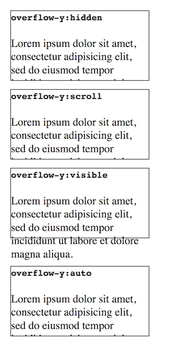

# Static examples on top

This document describes the work needed to implement the “static examples on top” project.
The “static examples on top” project will add static examples to the tops of JavaScript and CSS reference pages.

“Static” here means that the user won’t be able to interact with them (as compared with an example on codepen.io, for example).

## CSS pages
For the CSS reference pages, there are 2 parts:
 * Add “syntax examples” to the tops of the pages
 * Add “example outcomes” to the tops of the pages
 
### Syntax examples for CSS

CSS syntax examples are syntax-highlighted PRE blocks that show the syntax of the item by example, like this:

    /* Content is not clipped */
    overflow-y: visible;

    /* Content is clipped, with no scrollbars */
    overflow-y: hidden;

    /* Content is clipped, with scrollbars */
    overflow-y: scroll;

    /* Let the browser decide */
    overflow-y: auto;

*Most* pages already have a section like this, so the only work is to move it to the top.

### Example outcomes for CSS
Example outcomes show the effect of different values for the item. For example:

Most pages have live samples or other examples that could be adapted to be effective "example outcomes", but rework would be needed and every case would be different.

### What work is needed?

There are 503 pages under [https://developer.mozilla.org/en-US/docs/Web/CSS/](https://developer.mozilla.org/en-US/docs/Web/CSS/) that might need updates.

This number is arrived at as the total number of pages under https://developer.mozilla.org/en-US/docs/Web/CSS/ that contain one of the following tags: `"Property"`, `"CSS Property"`, `"Selectors"`, `"CSS Pseudo-class"`, `"Pseudo-class"`,
 `"CSS Pseudo-element"`, `"Pseudo-element"`, `"CSS Function"`, `"At-rule"`,
 `"CSS Data Type"`, `"CSS Data Types"`, `"Type"`.
 
 This is an upper bound: there are probably pages in here that are obsolete and don't need to be updated.

#### Syntax examples

For syntax examples, we have already updated 215 pages.

This includes about 160 pages updated during the Write the Docs writing day. This took 12 people, in probably a little more than half a day. We could then estimate a rate of 20-40 pages per day, so 2-3 weeks of effort ought to be enough to finish this work.

Note though that this parallelizes very well indeed.

#### Example outcomes

For example outcomes we don't have a clear picture. For one thing, it's likely that example outcomes won't work well for many CSS items, but we don't yet have a picture of which ones these are.

For another thing, this isn't repetitive work: each outcome should be designed differently. I think for this we should do an experiment of processing, say, 50 items to add example outcomes (or not add them if it is not appropriate) and extrapolate from that.

## JavaScript pages

For the JavaScript reference pages, we need to add a simple code example. The outcome is generally shown as a comment in the example:

    var a = ['zero', 'one', 'two', 'three'];
    var sliced = a.slice(1, 3);

    console.log(a);      // ['zero', 'one', 'two', 'three']
    console.log(sliced); // ['one', 'two']

It's not a great deal of work, but care is needed to design a concise helpful example.

### What work is needed?

[Structure of the MDN JavaScript docs](https://developer.mozilla.org/en-US/docs/MDN/Doc_status/JavaScript#Structure_of_the_MDN_JavaScript_docs) lists the number of pages in each section of the JS docs.

The table below breaks the work down into pieces, with each piece consisting of one or more sections of the JS reference docs:

<table>

<tr><th>Name</th><th>Number of pages</th></tr>
<tr><td>Value & function properties in the global scope, JSON, Boolean</td><td>16, 3, 5</td></tr>
<tr><td>Object</td><td>40</td></tr>
<tr><td>Function, Functions, Classes</td><td>14, 11, 4</td></tr>
<tr><td>(Array (done))</td><td>(38)</td></tr>
<tr><td>String, Template literals</td><td>50, 1</td></tr>
<tr><td>Number, Math</td><td>24, 44</td></tr>
<tr><td>Date</td><td>53</td></tr>
<tr><td>Regex</td><td>21</td></tr>
<tr><td>Intl</td><td>16</td></tr>
<tr><td>Map, WeakMap, Set, WeakSet</td><td>13, 7, 11, 6</td></tr>
<tr><td>Proxy, Reflect</td><td>17, 15</td></tr>
<tr><td>ArrayBuffer, DataView, TypedArray</td><td>6, 21, 34</td></tr>
<tr><td>Promise</td><td>8</td></tr>
<tr><td>Symbol</td><td>18</td></tr>
<tr><td>Atomics/SAB</td><td>17</td></tr>
<tr><td>Expressions & Operators</td><td>29</td></tr>
<tr><td>Statements & Declarations</td><td>27</td></tr>

</table>

= 531 (not including Array)

This is an upper bound though:

* We might choose to exclude DataView and TypedArray, which would remove 55 pages.

* Additionally there are 119 properties:
https://developer.mozilla.org/en-US/docs/Web/JavaScript/Reference/Properties_Index. For most of these we don't need examples on top.

This would make the lower bound about 357.

## Open questions

We're intending to go ahead with interactive examples, and they will replace static examples on all or most pages.

* Since CSS syntax examples are quick and cheap to move, they are still worth doing.

* Since JS examples would be easily reused for interactive examples, they are also still worth doing.

* Can we say the same about CSS example outcomes?

## What's next?

### CSS syntax examples

Add a story to the next sprint, to finish them off. There are a little under 300 pages left. If everyone takes a couple of days to work on this story, we can probably finish it off.

### CSS example outcomes

Add a story to the next sprint, to write example outcomes for the top 50 CSS properties. This will give us a better idea of what's involved here.

### JS examples

Hire a contractor to write these.
